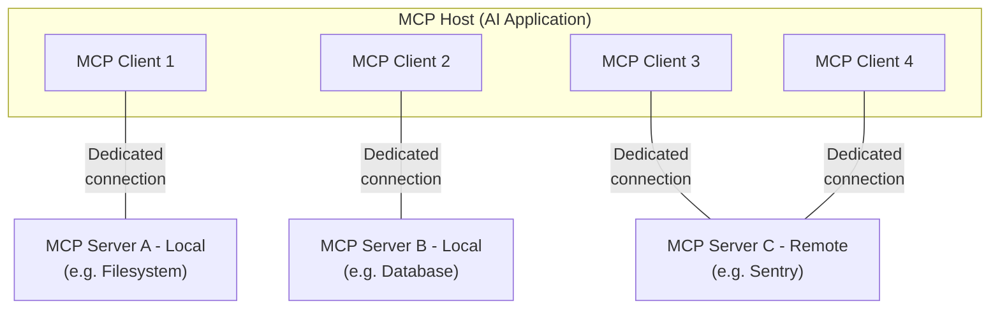

# Model context protocol server capabilities explanation

**Session ID:** ses_3b221d186ffe7E5HNGVb2WPEhH
**Created:** 2/11/2026, 11:32:12 PM
**Updated:** 2/11/2026, 11:42:41 PM

---

## User

Can you explain the capabilities of a model context protocol server?

---

## Assistant (Build · kimi-k2.5-free · 4.3s)

_Thinking:_

The user is asking about the capabilities of a model context protocol server. This is a question about what MCP (Model Context Protocol) servers can do. This is not about a specific codebase, but rather a general technical question.

I should provide a concise explanation of MCP server capabilities. Let me use the webfetch tool to get authoritative information about MCP from the official documentation if possible, or I can provide a general answer based on my knowledge.

Actually, let me use webfetch to get the most accurate and up-to-date information about MCP servers.

**Tool: webfetch**

**Input:**
```json
{
  "url": "https://modelcontextprotocol.io/introduction",
  "format": "markdown"
}
```

**Output:**
```
> ## Documentation Index
> Fetch the complete documentation index at: https://modelcontextprotocol.io/llms.txt
> Use this file to discover all available pages before exploring further.

# What is the Model Context Protocol (MCP)?

MCP (Model Context Protocol) is an open-source standard for connecting AI applications to external systems.

Using MCP, AI applications like Claude or ChatGPT can connect to data sources (e.g. local files, databases), tools (e.g. search engines, calculators) and workflows (e.g. specialized prompts)—enabling them to access key information and perform tasks.

Think of MCP like a USB-C port for AI applications. Just as USB-C provides a standardized way to connect electronic devices, MCP provides a standardized way to connect AI applications to external systems.

<Frame>
  
</Frame>

## What can MCP enable?

* Agents can access your Google Calendar and Notion, acting as a more personalized AI assistant.
* Claude Code can generate an entire web app using a Figma design.
* Enterprise chatbots can connect to multiple databases across an organization, empowering users to analyze data using chat.
* AI models can create 3D designs on Blender and print them out using a 3D printer.

## Why does MCP matter?

Depending on where you sit in the ecosystem, MCP can have a range of benefits.

* **Developers**: MCP reduces development time and complexity when building, or integrating with, an AI application or agent.
* **AI applications or agents**: MCP provides access to an ecosystem of data sources, tools and apps which will enhance capabilities and improve the end-user experience.
* **End-users**: MCP results in more capable AI applications or agents which can access your data and take actions on your behalf when necessary.

## Start Building

<CardGroup cols={2}>
  <Card title="Build servers" icon="server" href="/docs/develop/build-server">
    Create MCP servers to expose your data and tools
  </Card>

  <Card title="Build clients" icon="computer" href="/docs/develop/build-client">
    Develop applications that connect to MCP servers
  </Card>
</CardGroup>

## Learn more

<CardGroup cols={2}>
  <Card title="Understand concepts" icon="book" href="/docs/learn/architecture">
    Learn the core concepts and architecture of MCP
  </Card>
</CardGroup>

```

---

## Assistant (Build · kimi-k2.5-free · 3.2s)

_Thinking:_

The webfetch gave me a good overview of MCP. Let me fetch more specific information about the capabilities and architecture to give a comprehensive answer.

**Tool: webfetch**

**Input:**
```json
{
  "url": "https://modelcontextprotocol.io/docs/concepts/architecture",
  "format": "markdown"
}
```

**Output:**
```
> ## Documentation Index
> Fetch the complete documentation index at: https://modelcontextprotocol.io/llms.txt
> Use this file to discover all available pages before exploring further.

# Architecture overview

This overview of the Model Context Protocol (MCP) discusses its [scope](#scope) and [core concepts](#concepts-of-mcp), and provides an [example](#example) demonstrating each core concept.

Because MCP SDKs abstract away many concerns, most developers will likely find the [data layer protocol](#data-layer-protocol) section to be the most useful. It discusses how MCP servers can provide context to an AI application.

For specific implementation details, please refer to the documentation for your [language-specific SDK](/docs/sdk).

## Scope

The Model Context Protocol includes the following projects:

* [MCP Specification](https://modelcontextprotocol.io/specification/latest): A specification of MCP that outlines the implementation requirements for clients and servers.
* [MCP SDKs](/docs/sdk): SDKs for different programming languages that implement MCP.
* **MCP Development Tools**: Tools for developing MCP servers and clients, including the [MCP Inspector](https://github.com/modelcontextprotocol/inspector)
* [MCP Reference Server Implementations](https://github.com/modelcontextprotocol/servers): Reference implementations of MCP servers.

<Note>
  MCP focuses solely on the protocol for context exchange—it does not dictate
  how AI applications use LLMs or manage the provided context.
</Note>

## Concepts of MCP

### Participants

MCP follows a client-server architecture where an MCP host — an AI application like [Claude Code](https://www.anthropic.com/claude-code) or [Claude Desktop](https://www.claude.ai/download) — establishes connections to one or more MCP servers. The MCP host accomplishes this by creating one MCP client for each MCP server. Each MCP client maintains a dedicated connection with its corresponding MCP server.

Local MCP servers that use the STDIO transport typically serve a single MCP client, whereas remote MCP servers that use the Streamable HTTP transport will typically serve many MCP clients.

The key participants in the MCP architecture are:

* **MCP Host**: The AI application that coordinates and manages one or multiple MCP clients
* **MCP Client**: A component that maintains a connection to an MCP server and obtains context from an MCP server for the MCP host to use
* **MCP Server**: A program that provides context to MCP clients

**For example**: Visual Studio Code acts as an MCP host. When Visual Studio Code establishes a connection to an MCP server, such as the [Sentry MCP server](https://docs.sentry.io/product/sentry-mcp/), the Visual Studio Code runtime instantiates an MCP client object that maintains the connection to the Sentry MCP server.
When Visual Studio Code subsequently connects to another MCP server, such as the [local filesystem server](https://github.com/modelcontextprotocol/servers/tree/main/src/filesystem), the Visual Studio Code runtime instantiates an additional MCP client object to maintain this connection.



Note that **MCP server** refers to the program that serves context data, regardless of
where it runs. MCP servers can execute locally or remotely. For example, when
Claude Desktop launches the [filesystem
server](https://github.com/modelcontextprotocol/servers/tree/main/src/filesystem),
the server runs locally on the same machine because it uses the STDIO
transport. This is commonly referred to as a "local" MCP server. The official
[Sentry MCP server](https://docs.sentry.io/product/sentry-mcp/) runs on the
Sentry platform, and uses the Streamable HTTP transport. This is commonly
referred to as a "remote" MCP server.

### Layers

MCP consists of two layers:

* **Data layer**: Defines the JSON-RPC based protocol for client-server communication, including lifecycle management, and core primitives, such as tools, resources, prompts and notifications.
* **Transport layer**: Defines the communication mechanisms and channels that enable data exchange between clients and servers, including transport-specific connection establishment, message framing, and authorization.

Conceptually the data layer is the inner layer, while the transport layer is the outer layer.

#### Data layer

The data layer implements a [JSON-RPC 2.0](https://www.jsonrpc.org/) based exchange protocol that defines the message structure and semantics.
This layer includes:

* **Lifecycle management**: Handles connection initialization, capability negotiation, and connection termination between clients and servers
* **Server features**: Enables servers to provide core functionality including tools for AI actions, resources for context data, and prompts for interaction templates from and to the client
* **Client features**: Enables servers to ask the client to sample from the host LLM, elicit input from the user, and log messages to the client
* **Utility features**: Supports additional capabilities like notifications for real-time updates and progress tracking for long-running operations

#### Transport layer

The transport layer manages communication channels and authentication between clients and servers. It handles connection establishment, message framing, and secure communication between MCP participants.

MCP supports two transport mechanisms:

* **Stdio transport**: Uses standard input/output streams for direct process communication between local processes on the same machine, providing optimal performance with no network overhead.
* **Streamable HTTP transport**: Uses HTTP POST for client-to-server messages with optional Server-Sent Events for streaming capabilities. This transport enables remote server communication and supports standard HTTP authentication methods including bearer tokens, API keys, and custom headers. MCP recommends using OAuth to obtain authentication tokens.

The transport layer abstracts communication details from the protocol layer, enabling the same JSON-RPC 2.0 message format across all transport mechanisms.

### Data Layer Protocol

A core part of MCP is defining the schema and semantics between MCP clients and MCP servers. Developers will likely find the data layer — in particular, the set of [primitives](#primitives) — to be the most interesting part of MCP. It is the part of MCP that defines the ways developers can share context from MCP servers to MCP clients.

MCP uses [JSON-RPC 2.0](https://www.jsonrpc.org/) as its underlying RPC protocol. Client and servers send requests to each other and respond accordingly. Notifications can be used when no response is required.

#### Lifecycle management

MCP is a <Tooltip tip="A subset of MCP can be made stateless using the Streamable HTTP transport">stateful protocol</Tooltip> that requires lifecycle management. The purpose of lifecycle management is to negotiate the <Tooltip tip="Features and operations that a client or server supports, such as tools, resources, or prompts">capabilities</Tooltip> that both client and server support. Detailed information can be found in the [specification](/specification/latest/basic/lifecycle), and the [example](#example) showcases the initialization sequence.

#### Primitives

MCP primitives are the most important concept within MCP. They define what clients and servers can offer each other. These primitives specify the types of contextual information that can be shared with AI applications and the range of actions that can be performed.

MCP defines three core primitives that *servers* can expose:

* **Tools**: Executable functions that AI applications can invoke to perform actions (e.g., file operations, API calls, database queries)
* **Resources**: Data sources that provide contextual information to AI applications (e.g., file contents, database records, API responses)
* **Prompts**: Reusable templates that help structure interactions with language models (e.g., system prompts, few-shot examples)

Each primitive type has associated methods for discovery (`*/list`), retrieval (`*/get`), and in some cases, execution (`tools/call`).
MCP clients will use the `*/list` methods to discover available primitives. For example, a client can first list all available tools (`tools/list`) and then execute them. This design allows listings to be dynamic.

As a concrete example, consider an MCP server that provides context about a database. It can expose tools for querying the database, a resource that contains the schema of the database, and a prompt that includes few-shot examples for interacting with the tools.

For more details about server primitives see [server concepts](./server-concepts).

MCP also defines primitives that *clients* can expose. These primitives allow MCP server authors to build richer interactions.

* **Sampling**: Allows servers to request language model completions from the client's AI application. This is useful when server authors want access to a language model, but want to stay model-independent and not include a language model SDK in their MCP server. They can use the `sampling/complete` method to request a language model completion from the client's AI application.
* **Elicitation**: Allows servers to request additional information from users. This is useful when server authors want to get more information from the user, or ask for confirmation of an action. They can use the `elicitation/request` method to request additional information from the user.
* **Logging**: Enables servers to send log messages to clients for debugging and monitoring purposes.

For more details about client primitives see [client concepts](./client-concepts).

Besides server and client primitives, the protocol offers cross-cutting utility primitives that augment how requests are executed:

* **Tasks (Experimental)**: Durable execution wrappers that enable deferred result retrieval and status tracking for MCP requests (e.g., expensive computations, workflow automation, batch processing, multi-step operations)

#### Notifications

The protocol supports real-time notifications to enable dynamic updates between servers and clients. For example, when a server's available tools change—such as when new functionality becomes available or existing tools are modified—the server can send tool update notifications to inform connected clients about these changes. Notifications are sent as JSON-RPC 2.0 notification messages (without expecting a response) and enable MCP servers to provide real-time updates to connected clients.

## Example

### Data Layer

This section provides a step-by-step walkthrough of an MCP client-server interaction, focusing on the data layer protocol. We'll demonstrate the lifecycle sequence, tool operations, and notifications using JSON-RPC 2.0 messages.

<Steps>
  <Step title="Initialization (Lifecycle Management)">
    MCP begins with lifecycle management through a capability negotiation handshake. As described in the [lifecycle management](#lifecycle-management) section, the client sends an `initialize` request to establish the connection and negotiate supported features.

    <CodeGroup>
      ```json Initialize Request theme={null}
      {
        "jsonrpc": "2.0",
        "id": 1,
        "method": "initialize",
        "params": {
          "protocolVersion": "2025-06-18",
          "capabilities": {
            "elicitation": {}
          },
          "clientInfo": {
            "name": "example-client",
            "version": "1.0.0"
          }
        }
      }
      ```

      ```json Initialize Response theme={null}
      {
        "jsonrpc": "2.0",
        "id": 1,
        "result": {
          "protocolVersion": "2025-06-18",
          "capabilities": {
            "tools": {
              "listChanged": true
            },
            "resources": {}
          },
          "serverInfo": {
            "name": "example-server",
            "version": "1.0.0"
          }
        }
      }
      ```
    </CodeGroup>

    #### Understanding the Initialization Exchange

    The initialization process is a key part of MCP's lifecycle management and serves several critical purposes:

    1. **Protocol Version Negotiation**: The `protocolVersion` field (e.g., "2025-06-18") ensures both client and server are using compatible protocol versions. This prevents communication errors that could occur when different versions attempt to interact. If a mutually compatible version is not negotiated, the connection should be terminated.

    2. **Capability Discovery**: The `capabilities` object allows each party to declare what features they support, including which [primitives](#primitives) they can handle (tools, resources, prompts) and whether they support features like [notifications](#notifications). This enables efficient communication by avoiding unsupported operations.

    3. **Identity Exchange**: The `clientInfo` and `serverInfo` objects provide identification and versioning information for debugging and compatibility purposes.

    In this example, the capability negotiation demonstrates how MCP primitives are declared:

    **Client Capabilities**:

    * `"elicitation": {}` - The client declares it can work with user interaction requests (can receive `elicitation/create` method calls)

    **Server Capabilities**:

    * `"tools": {"listChanged": true}` - The server supports the tools primitive AND can send `tools/list_changed` notifications when its tool list changes
    * `"resources": {}` - The server also supports the resources primitive (can handle `resources/list` and `resources/read` methods)

    After successful initialization, the client sends a notification to indicate it's ready:

    ```json Notification theme={null}
    {
      "jsonrpc": "2.0",
      "method": "notifications/initialized"
    }
    ```

    #### How This Works in AI Applications

    During initialization, the AI application's MCP client manager establishes connections to configured servers and stores their capabilities for later use. The application uses this information to determine which servers can provide specific types of functionality (tools, resources, prompts) and whether they support real-time updates.

    ```python Pseudo-code for AI application initialization theme={null}
    # Pseudo Code
    async with stdio_client(server_config) as (read, write):
        async with ClientSession(read, write) as session:
            init_response = await session.initialize()
            if init_response.capabilities.tools:
                app.register_mcp_server(session, supports_tools=True)
            app.set_server_ready(session)
    ```
  </Step>

  <Step title="Tool Discovery (Primitives)">
    Now that the connection is established, the client can discover available tools by sending a `tools/list` request. This request is fundamental to MCP's tool discovery mechanism — it allows clients to understand what tools are available on the server before attempting to use them.

    <CodeGroup>
      ```json Tools List Request theme={null}
      {
        "jsonrpc": "2.0",
        "id": 2,
        "method": "tools/list"
      }
      ```

      ```json Tools List Response theme={null}
      {
        "jsonrpc": "2.0",
        "id": 2,
        "result": {
          "tools": [
            {
              "name": "calculator_arithmetic",
              "title": "Calculator",
              "description": "Perform mathematical calculations including basic arithmetic, trigonometric functions, and algebraic operations",
              "inputSchema": {
                "type": "object",
                "properties": {
                  "expression": {
                    "type": "string",
                    "description": "Mathematical expression to evaluate (e.g., '2 + 3 * 4', 'sin(30)', 'sqrt(16)')"
                  }
                },
                "required": ["expression"]
              }
            },
            {
              "name": "weather_current",
              "title": "Weather Information",
              "description": "Get current weather information for any location worldwide",
              "inputSchema": {
                "type": "object",
                "properties": {
                  "location": {
                    "type": "string",
                    "description": "City name, address, or coordinates (latitude,longitude)"
                  },
                  "units": {
                    "type": "string",
                    "enum": ["metric", "imperial", "kelvin"],
                    "description": "Temperature units to use in response",
                    "default": "metric"
                  }
                },
                "required": ["location"]
              }
            }
          ]
        }
      }
      ```
    </CodeGroup>

    #### Understanding the Tool Discovery Request

    The `tools/list` request is simple, containing no parameters.

    #### Understanding the Tool Discovery Response

    The response contains a `tools` array that provides comprehensive metadata about each available tool. This array-based structure allows servers to expose multiple tools simultaneously while maintaining clear boundaries between different functionalities.

    Each tool object in the response includes several key fields:

    * **`name`**: A unique identifier for the tool within the server's namespace. This serves as the primary key for tool execution and should follow a clear naming pattern (e.g., `calculator_arithmetic` rather than just `calculate`)
    * **`title`**: A human-readable display name for the tool that clients can show to users
    * **`description`**: Detailed explanation of what the tool does and when to use it
    * **`inputSchema`**: A JSON Schema that defines the expected input parameters, enabling type validation and providing clear documentation about required and optional parameters

    #### How This Works in AI Applications

    The AI application fetches available tools from all connected MCP servers and combines them into a unified tool registry that the language model can access. This allows the LLM to understand what actions it can perform and automatically generates the appropriate tool calls during conversations.

    ```python Pseudo-code for AI application tool discovery theme={null}
    # Pseudo-code using MCP Python SDK patterns
    available_tools = []
    for session in app.mcp_server_sessions():
        tools_response = await session.list_tools()
        available_tools.extend(tools_response.tools)
    conversation.register_available_tools(available_tools)
    ```
  </Step>

  <Step title="Tool Execution (Primitives)">
    The client can now execute a tool using the `tools/call` method. This demonstrates how MCP primitives are used in practice: after discovering available tools, the client can invoke them with appropriate arguments.

    #### Understanding the Tool Execution Request

    The `tools/call` request follows a structured format that ensures type safety and clear communication between client and server. Note that we're using the proper tool name from the discovery response (`weather_current`) rather than a simplified name:

    <CodeGroup>
      ```json Tool Call Request theme={null}
      {
        "jsonrpc": "2.0",
        "id": 3,
        "method": "tools/call",
        "params": {
          "name": "weather_current",
          "arguments": {
            "location": "San Francisco",
            "units": "imperial"
          }
        }
      }
      ```

      ```json Tool Call Response theme={null}
      {
        "jsonrpc": "2.0",
        "id": 3,
        "result": {
          "content": [
            {
              "type": "text",
              "text": "Current weather in San Francisco: 68°F, partly cloudy with light winds from the west at 8 mph. Humidity: 65%"
            }
          ]
        }
      }
      ```
    </CodeGroup>

    #### Key Elements of Tool Execution

    The request structure includes several important components:

    1. **`name`**: Must match exactly the tool name from the discovery response (`weather_current`). This ensures the server can correctly identify which tool to execute.

    2. **`arguments`**: Contains the input parameters as defined by the tool's `inputSchema`. In this example:
       * `location`: "San Francisco" (required parameter)
       * `units`: "imperial" (optional parameter, defaults to "metric" if not specified)

    3. **JSON-RPC Structure**: Uses standard JSON-RPC 2.0 format with unique `id` for request-response correlation.

    #### Understanding the Tool Execution Response

    The response demonstrates MCP's flexible content system:

    1. **`content` Array**: Tool responses return an array of content objects, allowing for rich, multi-format responses (text, images, resources, etc.)

    2. **Content Types**: Each content object has a `type` field. In this example, `"type": "text"` indicates plain text content, but MCP supports various content types for different use cases.

    3. **Structured Output**: The response provides actionable information that the AI application can use as context for language model interactions.

    This execution pattern allows AI applications to dynamically invoke server functionality and receive structured responses that can be integrated into conversations with language models.

    #### How This Works in AI Applications

    When the language model decides to use a tool during a conversation, the AI application intercepts the tool call, routes it to the appropriate MCP server, executes it, and returns the results back to the LLM as part of the conversation flow. This enables the LLM to access real-time data and perform actions in the external world.

    ```python  theme={null}
    # Pseudo-code for AI application tool execution
    async def handle_tool_call(conversation, tool_name, arguments):
        session = app.find_mcp_session_for_tool(tool_name)
        result = await session.call_tool(tool_name, arguments)
        conversation.add_tool_result(result.content)
    ```
  </Step>

  <Step title="Real-time Updates (Notifications)">
    MCP supports real-time notifications that enable servers to inform clients about changes without being explicitly requested. This demonstrates the notification system, a key feature that keeps MCP connections synchronized and responsive.

    #### Understanding Tool List Change Notifications

    When the server's available tools change—such as when new functionality becomes available, existing tools are modified, or tools become temporarily unavailable—the server can proactively notify connected clients:

    ```json Request theme={null}
    {
      "jsonrpc": "2.0",
      "method": "notifications/tools/list_changed"
    }
    ```

    #### Key Features of MCP Notifications

    1. **No Response Required**: Notice there's no `id` field in the notification. This follows JSON-RPC 2.0 notification semantics where no response is expected or sent.

    2. **Capability-Based**: This notification is only sent by servers that declared `"listChanged": true` in their tools capability during initialization (as shown in Step 1).

    3. **Event-Driven**: The server decides when to send notifications based on internal state changes, making MCP connections dynamic and responsive.

    #### Client Response to Notifications

    Upon receiving this notification, the client typically reacts by requesting the updated tool list. This creates a refresh cycle that keeps the client's understanding of available tools current:

    ```json Request theme={null}
    {
      "jsonrpc": "2.0",
      "id": 4,
      "method": "tools/list"
    }
    ```

    #### Why Notifications Matter

    This notification system is crucial for several reasons:

    1. **Dynamic Environments**: Tools may come and go based on server state, external dependencies, or user permissions
    2. **Efficiency**: Clients don't need to poll for changes; they're notified when updates occur
    3. **Consistency**: Ensures clients always have accurate information about available server capabilities
    4. **Real-time Collaboration**: Enables responsive AI applications that can adapt to changing contexts

    This notification pattern extends beyond tools to other MCP primitives, enabling comprehensive real-time synchronization between clients and servers.

    #### How This Works in AI Applications

    When the AI application receives a notification about changed tools, it immediately refreshes its tool registry and updates the LLM's available capabilities. This ensures that ongoing conversations always have access to the most current set of tools, and the LLM can dynamically adapt to new functionality as it becomes available.

    ```python  theme={null}
    # Pseudo-code for AI application notification handling
    async def handle_tools_changed_notification(session):
        tools_response = await session.list_tools()
        app.update_available_tools(session, tools_response.tools)
        if app.conversation.is_active():
            app.conversation.notify_llm_of_new_capabilities()
    ```
  </Step>
</Steps>

```

---

## Assistant (Build · kimi-k2.5-free · 6.0s)

_Thinking:_

Now I have comprehensive information about MCP servers. Let me provide a clear, concise explanation of their capabilities.

MCP (Model Context Protocol) servers provide AI applications with access to external systems through a standardized interface. Here's what MCP servers can do:

## Core Capabilities

**1. Expose Three Key Primitives:**
- **Tools** - Executable functions AI can invoke (file operations, API calls, database queries, calculations)
- **Resources** - Read-only contextual data (file contents, database records, API responses)
- **Prompts** - Reusable templates for structuring LLM interactions

**2. Support Real-time Updates:**
- Push notifications to clients when capabilities change
- Enable dynamic discovery without polling

**3. Request Client Capabilities:**
- **Sampling** - Request LLM completions from the host application
- **Elicitation** - Ask users for additional input or confirmation
- **Logging** - Send debug/monitoring messages to clients

## Transport Options
- **STDIO** - Local process communication (optimal performance)
- **HTTP + SSE** - Remote servers with streaming support

## Example Use Cases
- Database servers exposing query tools and schema resources
- File system servers providing read/write operations
- Third-party integrations (Slack, GitHub, Calendar APIs)
- Custom business logic and workflows

MCP servers follow a client-server architecture where an AI host (like Claude Code) creates clients that connect to servers, enabling the AI to access data and perform actions beyond its training data.

---

## User

I want to build a context normalization layer as a solution on top of my system, a project which is already built. and is matured, can you help me with first steps and architecture?

---

## Assistant (Build · kimi-k2.5-free · 11.8s)

_Thinking:_

The user wants to build a "context normalization layer" on top of their existing matured system. This sounds like they want to create an MCP (Model Context Protocol) server that acts as an abstraction/normalization layer between their existing system and AI clients.

Let me help them understand:
1. What a context normalization layer would do
2. First steps to architect and build it
3. How to integrate with their existing system

I should provide practical architectural guidance and concrete steps.

I'll help you design a context normalization layer. First, let me understand your existing system better.

**Quick Questions:**
1. What type of system is it? (API, database, file storage, business application, etc.)
2. What programming language/stack is it built in?
3. Who are the consumers? (internal teams, external AI agents, both?)

---

## Architecture Overview

A **Context Normalization Layer** acts as an adapter between your existing system and AI clients, translating your domain-specific data into MCP primitives.

```
┌─────────────────┐      ┌──────────────────────────┐      ┌─────────────────┐
│   AI Clients    │◄────►│  Context Normalization   │◄────►│ Existing System │
│  (Claude, etc.) │ MCP  │       Layer (MCP)        │ API  │  (Your System)  │
└─────────────────┘      └──────────────────────────┘      └─────────────────┘
```

## First Steps

### 1. **Audit Your System's Capabilities**
Map what your system can expose:
- **Data/Resources**: What read-only context is valuable? (records, configs, docs)
- **Actions/Tools**: What operations should AI trigger? (create, update, query, approve)
- **Templates/Prompts**: What reusable interactions make sense?

### 2. **Choose Your SDK**
Select an MCP SDK matching your existing stack:

| Language | SDK | Best For |
|----------|-----|----------|
| TypeScript | `@modelcontextprotocol/sdk` | Node.js systems |
| Python | `mcp` | Python backends, data pipelines |
| Java | `mcp-java-sdk` | JVM-based systems |

### 3. **Start with One Primitive**
Don't build all three at once. Pick the highest-impact:

- **Resources first** if AI needs to read/understand your data
- **Tools first** if AI needs to take actions in your system

### 4. **Implement the Server**

**Basic structure (TypeScript example):**
```typescript
import { Server } from "@modelcontextprotocol/sdk/server/index.js";
import { StdioServerTransport } from "@modelcontextprotocol/sdk/server/stdio.js";

const server = new Server({
  name: "your-system-mcp",
  version: "1.0.0"
}, {
  capabilities: {
    resources: {},  // Start here
    tools: {}       // Add later
  }
});

// Resource handler
server.setRequestHandler(ListResourcesRequestSchema, async () => {
  return {
    resources: [
      {
        uri: "system://users/list",
        name: "User Directory",
        mimeType: "application/json"
      }
    ]
  };
});

// Connect via stdio (local) or HTTP (remote)
const transport = new StdioServerTransport();
await server.connect(transport);
```

### 5. **Integration Pattern**

**Option A: Direct API Calls** (Simplest)
- MCP server calls your existing REST/GraphQL/gRPC APIs

**Option B: Database Connector** (For read-heavy)
- MCP server connects directly to your DB for resources

**Option C: Message Queue** (For async actions)
- MCP publishes actions to a queue your system consumes

---

## Recommended Next Steps

1. **Tell me about your system** (see questions above)
2. **Pick your first primitive** - What would be most valuable to expose?
3. **Prototype one resource or tool** - I can help you code it

What's your existing system built with, and what's the primary use case for the AI integration?

---

## User

This tool will be built as a package for many systems, so genralilsation has to happen. There are a few primitives, Code Repository access, Database Accesss, And sprint planning tool access. Also Team drive access but that will come later, can we just work on a plan 

---

## Assistant (Build · kimi-k2.5-free · 47.5s)

_Thinking:_

The user wants to build a generalized context normalization layer that will be a package for many systems. They have identified several primitives:

1. Code Repository access (GitHub/GitLab/etc)
2. Database Access
3. Sprint planning tool access (Jira/Linear/etc)

They want to work on a plan first, not code yet. This is about architecture planning for a multi-system MCP package.

Let me think about this carefully:
- They want to build a package/library that others can use
- It needs to support multiple backends (different code repos, different databases, different sprint tools)
- It should expose these through MCP primitives
- Needs to be extensible so more systems can be added later

This sounds like they need:
1. An adapter pattern architecture
2. Clear interfaces for each primitive type
3. A plugin/extension system
4. Configuration-driven setup

I should help them create a comprehensive plan for this architecture.

Perfect! You're building a **multi-adapter MCP framework**. Here's a comprehensive plan:

## Architecture Overview

```
┌─────────────────────────────────────────────────────────────┐
│                    MCP Host (Claude, etc.)                   │
└─────────────────────┬───────────────────────────────────────┘
                      │ MCP Protocol
┌─────────────────────▼───────────────────────────────────────┐
│              Your Context Normalization Package              │
│  ┌──────────────┬──────────────┬────────────────────────┐  │
│  │   Adapters   │   Adapters   │       Adapters         │  │
│  │  (GitHub)    │  (Postgres)  │      (Jira)            │  │
│  └──────┬───────┴──────┬───────┴──────────┬─────────────┘  │
│         │              │                  │                │
│         └──────────────┼──────────────────┘                │
│                        ▼                                    │
│              ┌──────────────────┐                          │
│              │  Normalization   │  ← Transforms to MCP     │
│              │     Engine       │     primitives           │
│              └────────┬─────────┘                          │
└───────────────────────┼─────────────────────────────────────┘
                        │
           ┌────────────┼────────────┐
           ▼            ▼            ▼
      [GitHub API] [DB Connection] [Jira API]
```

---

## Phase 1: Foundation (Week 1-2)

### 1. Define Core Interfaces

**Adapter Interface** (each system implements this):
```typescript
interface SystemAdapter {
  readonly systemType: string;
  readonly version: string;
  
  // Discovery
  getCapabilities(): AdapterCapabilities;
  
  // Resources (read-only data)
  listResources(): Promise<Resource[]>;
  readResource(uri: string): Promise<ResourceContent>;
  
  // Tools (actions)
  listTools(): Promise<Tool[]>;
  executeTool(name: string, args: any): Promise<ToolResult>;
  
  // Connection management
  connect(config: AdapterConfig): Promise<void>;
  disconnect(): Promise<void>;
  healthCheck(): Promise<HealthStatus>;
}
```

**AdapterCapabilities:**
```typescript
interface AdapterCapabilities {
  resources: boolean;
  tools: boolean;
  prompts: boolean;  // Future
  realTimeUpdates: boolean;  // Webhooks/SSE support
}
```

### 2. Configuration Schema

```yaml
# config.yaml
adapters:
  - type: github
    name: main-repo
    config:
      token: ${GITHUB_TOKEN}
      owner: myorg
      repos: ["repo1", "repo2"]
    enabled: true
    
  - type: postgresql
    name: prod-db
    config:
      connectionString: ${DB_URL}
      allowedTables: ["users", "projects"]
      readOnly: true
      
  - type: jira
    name: sprint-board
    config:
      host: https://mycompany.atlassian.net
      project: PROJ
      auth:
        type: token
        token: ${JIRA_TOKEN}
```

### 3. Package Structure

```
context-normalization-layer/
├── packages/
│   ├── core/                    # Core engine & MCP server
│   ├── adapters/
│   │   ├── github-adapter/      # GitHub implementation
│   │   ├── gitlab-adapter/      # GitLab implementation
│   │   ├── postgres-adapter/    # PostgreSQL implementation
│   │   ├── mysql-adapter/       # MySQL implementation
│   │   ├── jira-adapter/        # Jira implementation
│   │   ├── linear-adapter/       # Linear implementation
│   │   └── adapter-sdk/         # Interface definitions
│   └── cli/                     # Setup & configuration tool
├── examples/
│   ├── basic-setup/
│   └── advanced-config/
└── docs/
```

---

## Phase 2: Adapter Development (Week 3-6)

### Adapter 1: Code Repository (GitHub → MCP)

**Resources to expose:**
- `repo://{owner}/{repo}/files/{path}` - File contents
- `repo://{owner}/{repo}/commits` - Commit history
- `repo://{owner}/{repo}/pulls` - Pull requests
- `repo://{owner}/{repo}/issues` - Issues
- `repo://{owner}/{repo}/branches` - Branch list

**Tools to expose:**
- `github_search_code` - Search across repos
- `github_create_pr` - Create pull request
- `github_review_pr` - Review/comment on PR
- `github_get_file` - Fetch file with line numbers
- `github_list_directory` - Browse repo structure

### Adapter 2: Database (PostgreSQL → MCP)

**Resources to expose:**
- `db://{connection}/schema` - Database schema
- `db://{connection}/tables/{table}/structure` - Table structure
- `db://{connection}/tables/{table}/sample` - Sample data

**Tools to expose:**
- `db_query` - Execute SELECT queries (configurable)
- `db_explain_query` - Get query execution plan
- `db_list_tables` - List available tables
- `db_describe_table` - Get column info

**Safety considerations:**
- Read-only by default
- Query whitelist/blacklist
- Row limits
- Timeout controls

### Adapter 3: Sprint Planning (Jira → MCP)

**Resources to expose:**
- `sprint://{board}/backlog` - Product backlog
- `sprint://{board}/active` - Active sprint
- `sprint://{board}/issues/{key}` - Issue details

**Tools to expose:**
- `jira_create_issue` - Create ticket
- `jira_update_status` - Move ticket through workflow
- `jira_add_comment` - Comment on issue
- `jira_search_issues` - JQL search
- `jira_get_sprint_report` - Sprint metrics

---

## Phase 3: Normalization Engine (Week 4-5)

### Cross-System Linking

Enable relationships across adapters:

```typescript
// Example: Link PR to Jira ticket automatically
interface EntityLink {
  source: {
    adapter: string;
    resourceUri: string;
  };
  target: {
    adapter: string;
    resourceUri: string;
  };
  relationship: "implements" | "fixes" | "related";
  confidence: number;  // AI-detected vs manual
}
```

### Unified Query Interface

```typescript
// Allow queries across multiple systems
interface CrossSystemQuery {
  // "Find all PRs related to Jira tickets in current sprint"
  filter: {
    adapters: ["github", "jira"];
    relationships: ["implements"];
    conditions: [...];
  };
}
```

---

## Phase 4: Developer Experience (Week 6-8)

### 1. CLI Tool for Setup

```bash
# Initialize new project
npx context-layer init my-project

# Add adapters interactively
npx context-layer add github
npx context-layer add postgres
npx context-layer add jira

# Validate configuration
npx context-layer validate

# Test connections
npx context-layer test-connection github
```

### 2. Configuration Wizard

Interactive setup for:
- OAuth flows (GitHub, Jira)
- Database connection strings
- Permission scoping (read-only vs read-write)
- Resource filtering (which tables/repos/projects)

### 3. MCP Server Generator

```bash
# Generate MCP server from config
npx context-layer build

# Options
npx context-layer build --transport stdio    # Local
npx context-layer build --transport http     # Remote
npx context-layer build --watch             # Dev mode
```

---

## Phase 5: Distribution & Usage (Week 8+)

### Usage Patterns

**Pattern 1: As a Library**
```typescript
import { ContextLayer } from '@context-layer/core';

const layer = new ContextLayer({
  configPath: './context-layer.yaml'
});

await layer.start();
```

**Pattern 2: As a CLI**
```bash
context-layer serve --config ./config.yaml
```

**Pattern 3: Docker Container**
```bash
docker run -v $(pwd)/config.yaml:/config.yaml context-layer:latest
```

---

## Implementation Priority

| Phase | Priority | Effort | Value |
|-------|----------|--------|-------|
| 1. Core interfaces & config | 🔴 High | Medium | Critical |
| 2a. GitHub adapter | 🔴 High | Medium | High |
| 2b. PostgreSQL adapter | 🟡 Medium | Medium | High |
| 2c. Jira adapter | 🟡 Medium | Medium | Medium |
| 3. Normalization engine | 🟢 Low | High | Medium |
| 4. CLI & DX | 🟡 Medium | Medium | High |
| 5. Distribution | 🟢 Low | Low | Medium |

---

## Key Design Decisions to Make

1. **Transport**: STDIO for local, HTTP for remote?
2. **Auth**: Environment variables, keychain, or secret manager?
3. **Extensibility**: Plugin architecture for custom adapters?
4. **Caching**: Cache resources locally? For how long?
5. **Multi-tenancy**: One server per user or shared with permissions?

---

## Next Steps

Want me to:
1. **Deep-dive on Phase 1** - Design the core interfaces in detail?
2. **Start Phase 2** - Pick one adapter and design its MCP mapping?
3. **Create a PoC** - Build a minimal version with one system?
4. **Review the architecture** - Any concerns or changes needed?

Which direction feels right for your timeline and team size?

---

## User

export the plan into an md file

---

## Assistant (Build · kimi-k2.5-free · 25.2s)

_Thinking:_

The user wants me to export the plan into a markdown file. I should create a comprehensive markdown document with all the information from the previous response, organized in a clear structure.

**Tool: write**

**Input:**
```json
{
  "content": "# Context Normalization Layer - Implementation Plan\n\n## Overview\n\nA multi-adapter MCP (Model Context Protocol) framework that acts as a bridge between AI applications and existing systems. This package provides standardized access to Code Repositories, Databases, and Sprint Planning Tools through the MCP protocol.\n\n## Architecture\n\n```\n┌─────────────────────────────────────────────────────────────┐\n│                    MCP Host (Claude, etc.)                   │\n└─────────────────────┬───────────────────────────────────────┘\n                      │ MCP Protocol\n┌─────────────────────▼───────────────────────────────────────┐\n│              Your Context Normalization Package              │\n│  ┌──────────────┬──────────────┬────────────────────────┐  │\n│  │   Adapters   │   Adapters   │       Adapters         │  │\n│  │  (GitHub)    │  (Postgres)  │      (Jira)            │  │\n│  └──────┬───────┴──────┬───────┴──────────┬─────────────┘  │\n│         │              │                  │                │\n│         └──────────────┼──────────────────┘                │\n│                        ▼                                    │\n│              ┌──────────────────┐                          │\n│              │  Normalization   │  ← Transforms to MCP     │\n│              │     Engine       │     primitives           │\n│              └────────┬─────────┘                          │\n└───────────────────────┼─────────────────────────────────────┘\n                        │\n           ┌────────────┼────────────┐\n           ▼            ▼            ▼\n      [GitHub API] [DB Connection] [Jira API]\n```\n\n## Phase 1: Foundation (Week 1-2)\n\n### 1.1 Core Interfaces\n\n#### Adapter Interface\n\n```typescript\ninterface SystemAdapter {\n  readonly systemType: string;\n  readonly version: string;\n  \n  // Discovery\n  getCapabilities(): AdapterCapabilities;\n  \n  // Resources (read-only data)\n  listResources(): Promise<Resource[]>;\n  readResource(uri: string): Promise<ResourceContent>;\n  \n  // Tools (actions)\n  listTools(): Promise<Tool[]>;\n  executeTool(name: string, args: any): Promise<ToolResult>;\n  \n  // Connection management\n  connect(config: AdapterConfig): Promise<void>;\n  disconnect(): Promise<void>;\n  healthCheck(): Promise<HealthStatus>;\n}\n```\n\n#### Adapter Capabilities\n\n```typescript\ninterface AdapterCapabilities {\n  resources: boolean;\n  tools: boolean;\n  prompts: boolean;  // Future\n  realTimeUpdates: boolean;  // Webhooks/SSE support\n}\n```\n\n### 1.2 Configuration Schema\n\n```yaml\n# config.yaml\nadapters:\n  - type: github\n    name: main-repo\n    config:\n      token: ${GITHUB_TOKEN}\n      owner: myorg\n      repos: [\"repo1\", \"repo2\"]\n    enabled: true\n    \n  - type: postgresql\n    name: prod-db\n    config:\n      connectionString: ${DB_URL}\n      allowedTables: [\"users\", \"projects\"]\n      readOnly: true\n      \n  - type: jira\n    name: sprint-board\n    config:\n      host: https://mycompany.atlassian.net\n      project: PROJ\n      auth:\n        type: token\n        token: ${JIRA_TOKEN}\n```\n\n### 1.3 Package Structure\n\n```\ncontext-normalization-layer/\n├── packages/\n│   ├── core/                    # Core engine & MCP server\n│   ├── adapters/\n│   │   ├── github-adapter/      # GitHub implementation\n│   │   ├── gitlab-adapter/      # GitLab implementation\n│   │   ├── postgres-adapter/    # PostgreSQL implementation\n│   │   ├── mysql-adapter/       # MySQL implementation\n│   │   ├── jira-adapter/        # Jira implementation\n│   │   ├── linear-adapter/       # Linear implementation\n│   │   └── adapter-sdk/         # Interface definitions\n│   └── cli/                     # Setup & configuration tool\n├── examples/\n│   ├── basic-setup/\n│   └── advanced-config/\n└── docs/\n```\n\n## Phase 2: Adapter Development (Week 3-6)\n\n### 2.1 Code Repository Adapter (GitHub)\n\n#### Resources\n\n| Resource URI | Description |\n|--------------|-------------|\n| `repo://{owner}/{repo}/files/{path}` | File contents |\n| `repo://{owner}/{repo}/commits` | Commit history |\n| `repo://{owner}/{repo}/pulls` | Pull requests |\n| `repo://{owner}/{repo}/issues` | Issues |\n| `repo://{owner}/{repo}/branches` | Branch list |\n\n#### Tools\n\n- `github_search_code` - Search across repos\n- `github_create_pr` - Create pull request\n- `github_review_pr` - Review/comment on PR\n- `github_get_file` - Fetch file with line numbers\n- `github_list_directory` - Browse repo structure\n\n### 2.2 Database Adapter (PostgreSQL)\n\n#### Resources\n\n| Resource URI | Description |\n|--------------|-------------|\n| `db://{connection}/schema` | Database schema |\n| `db://{connection}/tables/{table}/structure` | Table structure |\n| `db://{connection}/tables/{table}/sample` | Sample data |\n\n#### Tools\n\n- `db_query` - Execute SELECT queries (configurable)\n- `db_explain_query` - Get query execution plan\n- `db_list_tables` - List available tables\n- `db_describe_table` - Get column info\n\n#### Safety Considerations\n\n- Read-only by default\n- Query whitelist/blacklist\n- Row limits\n- Timeout controls\n\n### 2.3 Sprint Planning Adapter (Jira)\n\n#### Resources\n\n| Resource URI | Description |\n|--------------|-------------|\n| `sprint://{board}/backlog` | Product backlog |\n| `sprint://{board}/active` | Active sprint |\n| `sprint://{board}/issues/{key}` | Issue details |\n\n#### Tools\n\n- `jira_create_issue` - Create ticket\n- `jira_update_status` - Move ticket through workflow\n- `jira_add_comment` - Comment on issue\n- `jira_search_issues` - JQL search\n- `jira_get_sprint_report` - Sprint metrics\n\n## Phase 3: Normalization Engine (Week 4-5)\n\n### 3.1 Cross-System Linking\n\nEnable relationships across adapters:\n\n```typescript\ninterface EntityLink {\n  source: {\n    adapter: string;\n    resourceUri: string;\n  };\n  target: {\n    adapter: string;\n    resourceUri: string;\n  };\n  relationship: \"implements\" | \"fixes\" | \"related\";\n  confidence: number;  // AI-detected vs manual\n}\n```\n\n### 3.2 Unified Query Interface\n\n```typescript\ninterface CrossSystemQuery {\n  // Example: \"Find all PRs related to Jira tickets in current sprint\"\n  filter: {\n    adapters: [\"github\", \"jira\"];\n    relationships: [\"implements\"];\n    conditions: [...];\n  };\n}\n```\n\n## Phase 4: Developer Experience (Week 6-8)\n\n### 4.1 CLI Tool\n\n```bash\n# Initialize new project\nnpx context-layer init my-project\n\n# Add adapters interactively\nnpx context-layer add github\nnpx context-layer add postgres\nnpx context-layer add jira\n\n# Validate configuration\nnpx context-layer validate\n\n# Test connections\nnpx context-layer test-connection github\n```\n\n### 4.2 Configuration Wizard\n\nInteractive setup for:\n- OAuth flows (GitHub, Jira)\n- Database connection strings\n- Permission scoping (read-only vs read-write)\n- Resource filtering (which tables/repos/projects)\n\n### 4.3 MCP Server Generator\n\n```bash\n# Generate MCP server from config\nnpx context-layer build\n\n# Options\nnpx context-layer build --transport stdio    # Local\nnpx context-layer build --transport http     # Remote\nnpx context-layer build --watch             # Dev mode\n```\n\n## Phase 5: Distribution & Usage (Week 8+)\n\n### 5.1 Usage Patterns\n\n#### As a Library\n\n```typescript\nimport { ContextLayer } from '@context-layer/core';\n\nconst layer = new ContextLayer({\n  configPath: './context-layer.yaml'\n});\n\nawait layer.start();\n```\n\n#### As a CLI\n\n```bash\ncontext-layer serve --config ./config.yaml\n```\n\n#### Docker Container\n\n```bash\ndocker run -v $(pwd)/config.yaml:/config.yaml context-layer:latest\n```\n\n## Implementation Priority\n\n| Phase | Priority | Effort | Value |\n|-------|----------|--------|-------|\n| 1. Core interfaces & config | 🔴 High | Medium | Critical |\n| 2a. GitHub adapter | 🔴 High | Medium | High |\n| 2b. PostgreSQL adapter | 🟡 Medium | Medium | High |\n| 2c. Jira adapter | 🟡 Medium | Medium | Medium |\n| 3. Normalization engine | 🟢 Low | High | Medium |\n| 4. CLI & DX | 🟡 Medium | Medium | High |\n| 5. Distribution | 🟢 Low | Low | Medium |\n\n## Key Design Decisions\n\n1. **Transport**: STDIO for local, HTTP for remote?\n2. **Auth**: Environment variables, keychain, or secret manager?\n3. **Extensibility**: Plugin architecture for custom adapters?\n4. **Caching**: Cache resources locally? For how long?\n5. **Multi-tenancy**: One server per user or shared with permissions?\n\n## Next Steps\n\n1. **Deep-dive on Phase 1** - Design the core interfaces in detail\n2. **Start Phase 2** - Pick one adapter and design its MCP mapping\n3. **Create a PoC** - Build a minimal version with one system\n4. **Review the architecture** - Refine based on team constraints\n\n---\n\n*Last updated: February 11, 2026*",
  "filePath": "C:\\Users\\vipul\\projects\\nlayer\\context-normalization-layer-plan.md"
}
```

**Output:**
```
Wrote file successfully.
```

---

## Assistant (Build · kimi-k2.5-free · 4.1s)

_Thinking:_

I've written the comprehensive plan to a markdown file. I should let the user know where it was saved and summarize what it contains.

I've exported the complete implementation plan to:

**`C:\Users\vipul\projects\nlayer\context-normalization-layer-plan.md`**

The file includes:

- Architecture diagram
- 5-phase implementation timeline
- Core TypeScript interfaces
- Configuration schema
- Package structure
- Adapter specifications for GitHub, PostgreSQL, and Jira
- CLI tool design
- Priority matrix
- Key design decisions to make

Ready to dive into any phase or start coding?

---

## User

So the crux of this project is not to build an mcp layer, but to build a context layer for agents working on these codebases will know.

---

## Assistant (Build · kimi-k2.5-free · 6.1s)

_Thinking:_

The user is clarifying the core purpose of the project. They're saying it's not just about building an MCP layer (which is the transport/protocol), but about building a context layer - meaning it's about understanding, enriching, and providing meaningful context about codebases to AI agents that work on them.

This is different from just exposing raw data via MCP. A "context layer" would:
1. Understand the codebase structure and relationships
2. Provide semantic understanding (not just file contents)
3. Track dependencies, architecture, business logic
4. Build a knowledge graph of the system
5. Help AI agents understand context across multiple systems
6. Normalize context across different sources so AI agents have a unified view

So this is more about building an intelligent context aggregation and understanding system that uses MCP as the delivery mechanism, but the value is in the context intelligence.

I should clarify this understanding and then pivot the plan to focus on:
- Code understanding (AST parsing, dependency analysis)
- Semantic context building (what does this code do, not just where is it)
- Cross-system context linking (e.g., PR relates to Jira ticket relates to DB migration)
- Context summarization and relevance ranking
- Incremental context updates
- Agent-specific context preparation

This is actually a more sophisticated and valuable system than just a generic MCP adapter.

**Tool: read**

**Input:**
```json
{
  "filePath": "C:\\Users\\vipul\\projects\\nlayer\\context-normalization-layer-plan.md"
}
```

**Output:**
```
<file>
00001| # Context Normalization Layer - Implementation Plan
00002| 
00003| ## Overview
00004| 
00005| A multi-adapter MCP (Model Context Protocol) framework that acts as a bridge between AI applications and existing systems. This package provides standardized access to Code Repositories, Databases, and Sprint Planning Tools through the MCP protocol.
00006| 
00007| ## Architecture
00008| 
00009| ```
00010| ┌─────────────────────────────────────────────────────────────┐
00011| │                    MCP Host (Claude, etc.)                   │
00012| └─────────────────────┬───────────────────────────────────────┘
00013|                       │ MCP Protocol
00014| ┌─────────────────────▼───────────────────────────────────────┐
00015| │              Your Context Normalization Package              │
00016| │  ┌──────────────┬──────────────┬────────────────────────┐  │
00017| │  │   Adapters   │   Adapters   │       Adapters         │  │
00018| │  │  (GitHub)    │  (Postgres)  │      (Jira)            │  │
00019| │  └──────┬───────┴──────┬───────┴──────────┬─────────────┘  │
00020| │         │              │                  │                │
00021| │         └──────────────┼──────────────────┘                │
00022| │                        ▼                                    │
00023| │              ┌──────────────────┐                          │
00024| │              │  Normalization   │  ← Transforms to MCP     │
00025| │              │     Engine       │     primitives           │
00026| │              └────────┬─────────┘                          │
00027| └───────────────────────┼─────────────────────────────────────┘
00028|                         │
00029|            ┌────────────┼────────────┐
00030|            ▼            ▼            ▼
00031|       [GitHub API] [DB Connection] [Jira API]
00032| ```
00033| 
00034| ## Phase 1: Foundation (Week 1-2)
00035| 
00036| ### 1.1 Core Interfaces
00037| 
00038| #### Adapter Interface
00039| 
00040| ```typescript
00041| interface SystemAdapter {
00042|   readonly systemType: string;
00043|   readonly version: string;
00044|   
00045|   // Discovery
00046|   getCapabilities(): AdapterCapabilities;
00047|   
00048|   // Resources (read-only data)
00049|   listResources(): Promise<Resource[]>;
00050|   readResource(uri: string): Promise<ResourceContent>;
00051|   
00052|   // Tools (actions)
00053|   listTools(): Promise<Tool[]>;
00054|   executeTool(name: string, args: any): Promise<ToolResult>;
00055|   
00056|   // Connection management
00057|   connect(config: AdapterConfig): Promise<void>;
00058|   disconnect(): Promise<void>;
00059|   healthCheck(): Promise<HealthStatus>;
00060| }
00061| ```
00062| 
00063| #### Adapter Capabilities
00064| 
00065| ```typescript
00066| interface AdapterCapabilities {
00067|   resources: boolean;
00068|   tools: boolean;
00069|   prompts: boolean;  // Future
00070|   realTimeUpdates: boolean;  // Webhooks/SSE support
00071| }
00072| ```
00073| 
00074| ### 1.2 Configuration Schema
00075| 
00076| ```yaml
00077| # config.yaml
00078| adapters:
00079|   - type: github
00080|     name: main-repo
00081|     config:
00082|       token: ${GITHUB_TOKEN}
00083|       owner: myorg
00084|       repos: ["repo1", "repo2"]
00085|     enabled: true
00086|     
00087|   - type: postgresql
00088|     name: prod-db
00089|     config:
00090|       connectionString: ${DB_URL}
00091|       allowedTables: ["users", "projects"]
00092|       readOnly: true
00093|       
00094|   - type: jira
00095|     name: sprint-board
00096|     config:
00097|       host: https://mycompany.atlassian.net
00098|       project: PROJ
00099|       auth:
00100|         type: token
00101|         token: ${JIRA_TOKEN}
00102| ```
00103| 
00104| ### 1.3 Package Structure
00105| 
00106| ```
00107| context-normalization-layer/
00108| ├── packages/
00109| │   ├── core/                    # Core engine & MCP server
00110| │   ├── adapters/
00111| │   │   ├── github-adapter/      # GitHub implementation
00112| │   │   ├── gitlab-adapter/      # GitLab implementation
00113| │   │   ├── postgres-adapter/    # PostgreSQL implementation
00114| │   │   ├── mysql-adapter/       # MySQL implementation
00115| │   │   ├── jira-adapter/        # Jira implementation
00116| │   │   ├── linear-adapter/       # Linear implementation
00117| │   │   └── adapter-sdk/         # Interface definitions
00118| │   └── cli/                     # Setup & configuration tool
00119| ├── examples/
00120| │   ├── basic-setup/
00121| │   └── advanced-config/
00122| └── docs/
00123| ```
00124| 
00125| ## Phase 2: Adapter Development (Week 3-6)
00126| 
00127| ### 2.1 Code Repository Adapter (GitHub)
00128| 
00129| #### Resources
00130| 
00131| | Resource URI | Description |
00132| |--------------|-------------|
00133| | `repo://{owner}/{repo}/files/{path}` | File contents |
00134| | `repo://{owner}/{repo}/commits` | Commit history |
00135| | `repo://{owner}/{repo}/pulls` | Pull requests |
00136| | `repo://{owner}/{repo}/issues` | Issues |
00137| | `repo://{owner}/{repo}/branches` | Branch list |
00138| 
00139| #### Tools
00140| 
00141| - `github_search_code` - Search across repos
00142| - `github_create_pr` - Create pull request
00143| - `github_review_pr` - Review/comment on PR
00144| - `github_get_file` - Fetch file with line numbers
00145| - `github_list_directory` - Browse repo structure
00146| 
00147| ### 2.2 Database Adapter (PostgreSQL)
00148| 
00149| #### Resources
00150| 
00151| | Resource URI | Description |
00152| |--------------|-------------|
00153| | `db://{connection}/schema` | Database schema |
00154| | `db://{connection}/tables/{table}/structure` | Table structure |
00155| | `db://{connection}/tables/{table}/sample` | Sample data |
00156| 
00157| #### Tools
00158| 
00159| - `db_query` - Execute SELECT queries (configurable)
00160| - `db_explain_query` - Get query execution plan
00161| - `db_list_tables` - List available tables
00162| - `db_describe_table` - Get column info
00163| 
00164| #### Safety Considerations
00165| 
00166| - Read-only by default
00167| - Query whitelist/blacklist
00168| - Row limits
00169| - Timeout controls
00170| 
00171| ### 2.3 Sprint Planning Adapter (Jira)
00172| 
00173| #### Resources
00174| 
00175| | Resource URI | Description |
00176| |--------------|-------------|
00177| | `sprint://{board}/backlog` | Product backlog |
00178| | `sprint://{board}/active` | Active sprint |
00179| | `sprint://{board}/issues/{key}` | Issue details |
00180| 
00181| #### Tools
00182| 
00183| - `jira_create_issue` - Create ticket
00184| - `jira_update_status` - Move ticket through workflow
00185| - `jira_add_comment` - Comment on issue
00186| - `jira_search_issues` - JQL search
00187| - `jira_get_sprint_report` - Sprint metrics
00188| 
00189| ## Phase 3: Normalization Engine (Week 4-5)
00190| 
00191| ### 3.1 Cross-System Linking
00192| 
00193| Enable relationships across adapters:
00194| 
00195| ```typescript
00196| interface EntityLink {
00197|   source: {
00198|     adapter: string;
00199|     resourceUri: string;
00200|   };
00201|   target: {
00202|     adapter: string;
00203|     resourceUri: string;
00204|   };
00205|   relationship: "implements" | "fixes" | "related";
00206|   confidence: number;  // AI-detected vs manual
00207| }
00208| ```
00209| 
00210| ### 3.2 Unified Query Interface
00211| 
00212| ```typescript
00213| interface CrossSystemQuery {
00214|   // Example: "Find all PRs related to Jira tickets in current sprint"
00215|   filter: {
00216|     adapters: ["github", "jira"];
00217|     relationships: ["implements"];
00218|     conditions: [...];
00219|   };
00220| }
00221| ```
00222| 
00223| ## Phase 4: Developer Experience (Week 6-8)
00224| 
00225| ### 4.1 CLI Tool
00226| 
00227| ```bash
00228| # Initialize new project
00229| npx context-layer init my-project
00230| 
00231| # Add adapters interactively
00232| npx context-layer add github
00233| npx context-layer add postgres
00234| npx context-layer add jira
00235| 
00236| # Validate configuration
00237| npx context-layer validate
00238| 
00239| # Test connections
00240| npx context-layer test-connection github
00241| ```
00242| 
00243| ### 4.2 Configuration Wizard
00244| 
00245| Interactive setup for:
00246| - OAuth flows (GitHub, Jira)
00247| - Database connection strings
00248| - Permission scoping (read-only vs read-write)
00249| - Resource filtering (which tables/repos/projects)
00250| 
00251| ### 4.3 MCP Server Generator
00252| 
00253| ```bash
00254| # Generate MCP server from config
00255| npx context-layer build
00256| 
00257| # Options
00258| npx context-layer build --transport stdio    # Local
00259| npx context-layer build --transport http     # Remote
00260| npx context-layer build --watch             # Dev mode
00261| ```
00262| 
00263| ## Phase 5: Distribution & Usage (Week 8+)
00264| 
00265| ### 5.1 Usage Patterns
00266| 
00267| #### As a Library
00268| 
00269| ```typescript
00270| import { ContextLayer } from '@context-layer/core';
00271| 
00272| const layer = new ContextLayer({
00273|   configPath: './context-layer.yaml'
00274| });
00275| 
00276| await layer.start();
00277| ```
00278| 
00279| #### As a CLI
00280| 
00281| ```bash
00282| context-layer serve --config ./config.yaml
00283| ```
00284| 
00285| #### Docker Container
00286| 
00287| ```bash
00288| docker run -v $(pwd)/config.yaml:/config.yaml context-layer:latest
00289| ```
00290| 
00291| ## Implementation Priority
00292| 
00293| | Phase | Priority | Effort | Value |
00294| |-------|----------|--------|-------|
00295| | 1. Core interfaces & config | 🔴 High | Medium | Critical |
00296| | 2a. GitHub adapter | 🔴 High | Medium | High |
00297| | 2b. PostgreSQL adapter | 🟡 Medium | Medium | High |
00298| | 2c. Jira adapter | 🟡 Medium | Medium | Medium |
00299| | 3. Normalization engine | 🟢 Low | High | Medium |
00300| | 4. CLI & DX | 🟡 Medium | Medium | High |
00301| | 5. Distribution | 🟢 Low | Low | Medium |
00302| 
00303| ## Key Design Decisions
00304| 
00305| 1. **Transport**: STDIO for local, HTTP for remote?
00306| 2. **Auth**: Environment variables, keychain, or secret manager?
00307| 3. **Extensibility**: Plugin architecture for custom adapters?
00308| 4. **Caching**: Cache resources locally? For how long?
00309| 5. **Multi-tenancy**: One server per user or shared with permissions?
00310| 
00311| ## Next Steps
00312| 
00313| 1. **Deep-dive on Phase 1** - Design the core interfaces in detail
00314| 2. **Start Phase 2** - Pick one adapter and design its MCP mapping
00315| 3. **Create a PoC** - Build a minimal version with one system
00316| 4. **Review the architecture** - Refine based on team constraints
00317| 
00318| ---
00319| 
00320| *Last updated: February 11, 2026*

(End of file - total 320 lines)
</file>
```

---

## Assistant (Build · kimi-k2.5-free · 67.5s)

_Thinking:_

The user is clarifying that this isn't just about building an MCP layer - it's about building a context layer. That means the system should understand and provide meaningful context about codebases, not just expose raw data.

The key insight is:
- MCP is just the transport protocol
- The value is in understanding the codebase semantically
- Building a knowledge graph of the system
- Tracking dependencies and relationships
- Providing context that helps AI agents understand the system better

So I need to rewrite the document to focus on:
1. Code understanding (AST parsing, dependency analysis, semantic analysis)
2. Context graph building
3. Context summarization and relevance ranking
4. Cross-system context linking
5. The context layer itself, not just adapters

Let me update the document with this new focus.

**Tool: write**

**Input:**
```json
{
  "content": "# Context Layer for AI Agents - Implementation Plan\n\n## Core Concept\n\n**This is NOT an MCP adapter layer - it's an intelligent context system.**\n\nThe Context Layer builds a semantic understanding of codebases, databases, and project management systems to provide AI agents with rich, meaningful context. MCP is just the delivery mechanism.\n\n## What This System Actually Does\n\nInstead of exposing raw files and API data, this system:\n\n1. **Understands Code Semantically** - Parses ASTs, extracts dependencies, identifies patterns\n2. **Builds a Knowledge Graph** - Maps entities (functions, tables, tickets) and their relationships\n3. **Tracks Cross-System Links** - Connects PRs to Jira tickets, DB migrations to code changes\n4. **Summarizes & Ranks Context** - Provides relevant context based on what the agent is working on\n5. **Maintains Temporal Context** - Understands what changed recently and why\n\n## Architecture\n\n```\n┌──────────────────────────────────────────────────────────────┐\n│                    AI Agent (Claude, etc.)                    │\n└──────────────────────┬───────────────────────────────────────┘\n                       │ MCP Protocol\n┌──────────────────────▼───────────────────────────────────────┐\n│                 Context Layer (This System)                   │\n│  ┌─────────────────────────────────────────────────────────┐ │\n│  │              Context Delivery Layer (MCP)                │ │\n│  │  • Exposes tools/resources via MCP                       │ │\n│  │  • Handles agent queries                                 │ │\n│  └────────────────────────┬────────────────────────────────┘ │\n│                           │                                  │\n│  ┌────────────────────────▼────────────────────────────────┐ │\n│  │              Context Intelligence Engine                 │ │\n│  │  • Query understanding & context routing                 │ │\n│  │  • Relevance ranking & summarization                     │ │\n│  │  • Context composition (what to include/exclude)         │ │\n│  └────────────────────────┬────────────────────────────────┘ │\n│                           │                                  │\n│  ┌────────────────────────▼────────────────────────────────┐ │\n│  │                 Knowledge Graph                          │ │\n│  │  • Entities: files, functions, tables, tickets, users    │ │\n│  │  • Relationships: calls, depends_on, implements, fixes   │ │\n│  │  • Metadata: ownership, complexity, last modified        │ │\n│  └────────────────────────┬────────────────────────────────┘ │\n│                           │                                  │\n│  ┌──────────┬─────────────┼─────────────┬───────────────────┐ │\n│  │          │             │             │                   │ │\n│  ▼          ▼             ▼             ▼                   │ │\n│ ┌──────┐ ┌──────┐    ┌──────┐     ┌─────────┐              │ │\n│ │Code  │ │Code  │    │DB    │     │Project  │              │ │\n│ │Parser│ │Graph  │    │Schema│     │Manager  │              │ │\n│ │      │ │Builder│    │Analyzer│   │Adapter  │              │ │\n│ └──┬───┘ └──┬───┘    └──┬───┘     └────┬────┘              │ │\n│    │        │           │              │                    │ │\n│    └────────┴───────────┴──────────────┘                    │ │\n│                         │                                   │ │\n│              ┌──────────▼──────────┐                       │ │\n│              │  Data Connectors    │                       │ │\n│              │  (Git, DB APIs, etc)│                       │ │\n│              └─────────────────────┘                       │ │\n└────────────────────────────────────────────────────────────┘\n```\n\n## Core Capabilities\n\n### 1. Semantic Code Understanding\n\n**Not just files - understand what the code does:**\n\n```typescript\ninterface CodeEntity {\n  id: string;\n  type: 'function' | 'class' | 'interface' | 'module';\n  name: string;\n  signature: string;\n  purpose: string;           // AI-generated description\n  inputs: Parameter[];       // Not just types, but semantic meaning\n  outputs: TypeInfo;\n  sideEffects: string[];     // What does it modify?\n  dependencies: string[];    // Other entities it calls\n  complexity: number;        // Cyclomatic complexity\n  testCoverage: number;\n  owner: string;            // Team/person responsible\n}\n```\n\n**Example Queries This Enables:**\n- \"Show me all functions that handle user authentication\"\n- \"What code is affected by changes to the User model?\"\n- \"Find the implementation of the payment webhook handler\"\n- \"Which functions call the database in a transaction?\"\n\n### 2. Cross-System Context Linking\n\n**Connect the dots between code, database, and project management:**\n\n```typescript\ninterface ContextLink {\n  id: string;\n  source: {\n    system: 'code' | 'database' | 'project' | 'documentation';\n    entityId: string;\n    context: any;\n  };\n  target: {\n    system: 'code' | 'database' | 'project' | 'documentation';\n    entityId: string;\n    context: any;\n  };\n  relationship: \n    | 'implements'      // Code implements ticket\n    | 'depends_on'      // Entity depends on another\n    | 'affects'         // Change affects other entity\n    | 'references'      // Code references table\n    | 'migrates'        // Migration changes schema\n    | 'tests'           // Test covers code\n    | 'owns';           // Team owns component\n  evidence: string[];   // Why this link exists\n  confidence: number;   // 0-1, how sure are we?\n  createdAt: Date;\n  lastVerified: Date;\n}\n```\n\n**Examples:**\n- PR #234 implements Jira ticket PROJ-123\n- Function `createUser()` references table `users`\n- Database migration `add_email_index` affects query performance\n- Test file `auth.test.ts` covers function `validateToken()`\n\n### 3. Context Summarization & Ranking\n\n**Provide just the right amount of context:**\n\n```typescript\ninterface ContextQuery {\n  agentIntent: string;      // What is the agent trying to do?\n  currentFile?: string;     // What file is currently open?\n  currentLine?: number;     // Where is the cursor?\n  task?: string;            // Overall task description\n  depth: 'surface' | 'related' | 'deep';  // How much context?\n}\n\ninterface ContextResponse {\n  summary: string;          // Brief overview\n  relevantEntities: EntityWithRelevance[];\n  dependencies: Entity[];   // What this code depends on\n  dependents: Entity[];     // What depends on this code\n  relatedTickets: Ticket[];\n  recentChanges: Change[];  // Recent modifications\n  suggestedNextSteps: string[];\n}\n```\n\n**Scenarios:**\n- Agent opens a file → Show overview + key dependencies\n- Agent asks about a bug → Show error context + related code + tickets\n- Agent starts a new task → Show relevant code patterns + examples\n\n### 4. Temporal Context\n\n**Understand what happened recently:**\n\n```typescript\ninterface TemporalContext {\n  recentCommits: Commit[];         // Last 7 days\n  activeSprint: Sprint;\n  openPRs: PullRequest[];\n  pendingReviews: Review[];\n  recentDeployments: Deployment[];\n  currentIncidents: Incident[];\n  \n  // What changed in files the agent is looking at?\n  fileHistory: {\n    file: string;\n    lastModified: Date;\n    lastModifiedBy: string;\n    relatedCommits: Commit[];\n    relatedTickets: Ticket[];\n  };\n}\n```\n\n## Phase 1: Foundation (Week 1-2)\n\n### 1.1 Knowledge Graph Schema\n\nDefine the entities and relationships:\n\n```typescript\n// Core entities across all systems\ninterface Entity {\n  id: string;\n  type: EntityType;\n  name: string;\n  system: 'code' | 'database' | 'project';\n  metadata: Record<string, any>;\n  createdAt: Date;\n  updatedAt: Date;\n}\n\ntype EntityType = \n  // Code entities\n  | 'file' | 'function' | 'class' | 'interface' | 'module' | 'variable' | 'type'\n  // Database entities\n  | 'table' | 'column' | 'index' | 'migration' | 'view'\n  // Project entities\n  | 'ticket' | 'sprint' | 'pr' | 'commit' | 'comment';\n\ninterface Relationship {\n  id: string;\n  sourceId: string;\n  targetId: string;\n  type: RelationshipType;\n  metadata: any;\n  confidence: number;\n}\n\ntype RelationshipType =\n  | 'contains'           // File contains function\n  | 'calls'              // Function calls function\n  | 'imports'            // File imports module\n  | 'references'         // Code references table\n  | 'implements'         // PR implements ticket\n  | 'affects'            // Migration affects table\n  | 'tests'              // Test tests function\n  | 'depends_on'         // General dependency\n  | 'owns';              // Team owns component\n```\n\n### 1.2 Graph Database Setup\n\nChoose storage for the knowledge graph:\n\n**Option A: Neo4j** (Recommended)\n- Native graph database\n- Excellent relationship queries\n- Cypher query language\n- Good for complex traversals\n\n**Option B: PostgreSQL with pg_graph**\n- If already using Postgres\n- Good for simpler graphs\n- Single database to maintain\n\n**Option C: In-memory with persistence**\n- Fast for development\n- Serialize to JSON/Redis\n- Good for smaller codebases\n\n### 1.3 Core Data Models\n\n```typescript\n// Code understanding\ninterface CodeContext {\n  repository: string;\n  branch: string;\n  commit: string;\n  files: FileContext[];\n}\n\ninterface FileContext {\n  path: string;\n  language: string;\n  imports: string[];\n  exports: string[];\n  entities: CodeEntity[];\n  complexity: number;\n  linesOfCode: number;\n  lastModified: Date;\n}\n\n// Database understanding\ninterface DatabaseContext {\n  connection: string;\n  schema: SchemaContext;\n}\n\ninterface SchemaContext {\n  tables: TableContext[];\n  migrations: MigrationContext[];\n  relationships: ForeignKey[];\n}\n\ninterface TableContext {\n  name: string;\n  columns: ColumnContext[];\n  indexes: Index[];\n  estimatedRows: number;\n  referencedBy: string[];  // Other tables referencing this\n}\n\n// Project context\ninterface ProjectContext {\n  board: string;\n  currentSprint: Sprint;\n  tickets: TicketContext[];\n  pullRequests: PRContext[];\n}\n```\n\n## Phase 2: Code Understanding Engine (Week 3-4)\n\n### 2.1 Code Parser\n\nBuild parsers for major languages:\n\n```typescript\ninterface CodeParser {\n  language: string;\n  extensions: string[];\n  \n  parse(filePath: string, content: string): ParsedFile;\n  extractEntities(ast: AST): CodeEntity[];\n  extractImports(ast: AST): Import[];\n  extractDependencies(entity: CodeEntity): string[];\n}\n\ninterface ParsedFile {\n  path: string;\n  language: string;\n  ast: AST;\n  entities: CodeEntity[];\n  imports: Import[];\n  exports: Export[];\n  complexity: number;\n}\n```\n\n**Languages to support (in order):**\n1. TypeScript/JavaScript (tree-sitter)\n2. Python (tree-sitter or ast module)\n3. Java (JavaParser or similar)\n4. Go (go/parser)\n5. SQL (for stored procedures)\n\n### 2.2 Dependency Analyzer\n\nMap code dependencies:\n\n```typescript\ninterface DependencyAnalyzer {\n  // Build dependency graph\n  analyzeFile(file: ParsedFile): Dependency[];\n  \n  // Find circular dependencies\n  detectCycles(): Cycle[];\n  \n  // Find unused code\n  findDeadCode(): CodeEntity[];\n  \n  // Calculate impact of changes\n  calculateImpact(changedFiles: string[]): ImpactAnalysis;\n}\n\ninterface ImpactAnalysis {\n  directlyAffected: CodeEntity[];\n  indirectlyAffected: CodeEntity[];\n  testsToRun: Test[];\n  filesToReview: string[];\n}\n```\n\n### 2.3 Semantic Analysis\n\nAdd meaning to code:\n\n```typescript\ninterface SemanticAnalyzer {\n  // Detect patterns\n  detectPatterns(file: ParsedFile): Pattern[];\n  \n  // Identify purpose\n  analyzePurpose(entity: CodeEntity): string;\n  \n  // Extract business logic\n  extractBusinessRules(file: ParsedFile): BusinessRule[];\n  \n  // Security analysis\n  detectSecurityIssues(file: ParsedFile): SecurityIssue[];\n}\n\ninterface Pattern {\n  type: 'singleton' | 'factory' | 'repository' | 'controller' | 'middleware';\n  confidence: number;\n  evidence: string[];\n}\n```\n\n## Phase 3: Cross-System Linking (Week 4-5)\n\n### 3.1 Link Detection\n\nAutomatically detect relationships:\n\n```typescript\ninterface LinkDetector {\n  // Code → Ticket links\n  detectTicketReferences(code: CodeEntity): TicketReference[];\n  \n  // PR → Ticket links\n  detectPRTicketLinks(pr: PR): TicketLink[];\n  \n  // Code → Database links\n  detectDatabaseReferences(code: CodeEntity): DBReference[];\n  \n  // Migration → Code links\n  detectMigrationImpact(migration: Migration): AffectedCode[];\n}\n\n// Detect patterns like:\n// - \"fixes PROJ-123\" in commit messages\n// - \"TODO(PROJ-456)\" in code comments\n// - Table names in SQL strings\n// - Migration filenames matching ticket IDs\n```\n\n### 3.2 Link Confidence Scoring\n\nNot all links are equal:\n\n```typescript\ninterface ConfidenceScorer {\n  // Score based on evidence\n  scoreLink(link: ContextLink): number;\n  \n  // Factors:\n  // - Explicit mention (commit message says \"fixes PROJ-123\")\n  // - Timing (PR created after ticket assigned)\n  // - Author (same person working on ticket and code)\n  // - File naming (feature/PROJ-123-branch-name)\n  // - Content analysis (code matches ticket description)\n}\n```\n\n### 3.3 Manual Link Management\n\nAllow developers to curate:\n\n```typescript\ninterface LinkManager {\n  // Add manual link\n  createLink(link: ContextLink): void;\n  \n  // Confirm auto-detected link\n  confirmLink(linkId: string): void;\n  \n  // Reject false positive\n  rejectLink(linkId: string): void;\n  \n  // Bulk operations\n  bulkImportLinks(links: ContextLink[]): void;\n  \n  // Export for documentation\n  exportLinks(): LinkExport;\n}\n```\n\n## Phase 4: Context Delivery (Week 5-6)\n\n### 4.1 MCP Resource Design\n\n**Resources expose rich context, not raw data:**\n\n```typescript\n// Resource: Code entity with full context\ninterface CodeContextResource {\n  uri: string;  // \"context://code/{repo}/{file}/{entity}\"\n  \n  // The entity itself\n  entity: CodeEntity;\n  \n  // Context that matters\n  dependencies: CodeEntity[];      // What it uses\n  dependents: CodeEntity[];        // What uses it\n  relatedTickets: Ticket[];        // Associated work\n  recentChanges: Commit[];         // Recent modifications\n  tests: Test[];                   // Test coverage\n  \n  // AI-friendly summary\n  summary: string;\n  purpose: string;\n  usageExamples: string[];\n  gotchas: string[];              // Known issues/gotchas\n}\n\n// Resource: Task context\ninterface TaskContextResource {\n  uri: string;  // \"context://task/{ticket-id}\"\n  \n  ticket: Ticket;\n  relatedCode: CodeEntity[];\n  relatedPRs: PR[];\n  affectedTables: TableContext[];\n  suggestedApproach: string;\n  similarPastTasks: Ticket[];\n}\n\n// Resource: Current workspace context\ninterface WorkspaceContextResource {\n  uri: string;  // \"context://workspace/current\"\n  \n  openFiles: FileContext[];\n  currentTask?: Ticket;\n  recentActivity: Activity[];\n  relevantCode: CodeEntity[];\n  pendingReviews: Review[];\n}\n```\n\n### 4.2 Context Query Tools\n\n**Tools for agents to request specific context:**\n\n```typescript\n// Tool: Find code by semantic meaning\n{\n  name: \"find_code\",\n  description: \"Find code entities by semantic description\",\n  inputSchema: {\n    query: string,           // \"authentication middleware\"\n    language?: string,       // \"typescript\"\n    filePattern?: string,    // \"*.middleware.ts\"\n    includeTests?: boolean,\n    limit: number\n  }\n}\n\n// Tool: Get impact analysis\n{\n  name: \"analyze_impact\",\n  description: \"Analyze what code would be affected by changes\",\n  inputSchema: {\n    files: string[],         // Files being modified\n    includeTests: boolean,\n    includeDependents: boolean\n  }\n}\n\n// Tool: Get task context\n{\n  name: \"get_task_context\",\n  description: \"Get full context for a task/ticket\",\n  inputSchema: {\n    ticketId: string,\n    includeHistory: boolean,\n    includeRelated: boolean\n  }\n}\n\n// Tool: Find similar code\n{\n  name: \"find_similar\",\n  description: \"Find code similar to a pattern\",\n  inputSchema: {\n    pattern: string,         // Code snippet or description\n    context: string          // Where to search\n  }\n}\n```\n\n### 4.3 Context Composition Engine\n\n**Smart context assembly:**\n\n```typescript\ninterface ContextComposer {\n  // Compose context based on agent query\n  composeContext(query: ContextQuery): ContextResponse;\n  \n  // Strategies:\n  // 1. Intent-based: What is the agent trying to do?\n  // 2. Location-based: What's near the cursor?\n  // 3. Task-based: What ticket is being worked on?\n  // 4. Temporal: What's been happening recently?\n  \n  // Rank relevance\n  rankEntities(query: string, entities: Entity[]): RankedEntity[];\n  \n  // Summarize for token limits\n  summarizeContext(context: ContextResponse, maxTokens: number): string;\n}\n```\n\n## Phase 5: Intelligence Features (Week 7-8)\n\n### 5.1 Pattern Recognition\n\n```typescript\ninterface PatternRecognizer {\n  // Learn from codebase\n  learnPatterns(repository: string): CodePattern[];\n  \n  // Suggest patterns for new code\n  suggestPattern(task: string): CodePattern;\n  \n  // Detect anti-patterns\n  detectAntiPatterns(code: CodeEntity): Issue[];\n  \n  // Find examples\n  findExamples(pattern: string): CodeExample[];\n}\n```\n\n### 5.2 Change Prediction\n\n```typescript\ninterface ChangePredictor {\n  // What files typically change together?\n  detectCoChanges(): FileGroup[];\n  \n  // Predict what else needs to change\n  predictRequiredChanges(changedFiles: string[]): Prediction[];\n  \n  // Suggest tests to add\n  suggestTests(changedFiles: string[]): TestSuggestion[];\n}\n```\n\n### 5.3 Documentation Generation\n\n```typescript\ninterface DocumentationEngine {\n  // Generate README from code structure\n  generateOverview(): Documentation;\n  \n  // Document specific component\n  documentComponent(entity: CodeEntity): string;\n  \n  // Keep docs in sync\n  detectDocDrift(): DocIssue[];\n}\n```\n\n## Phase 6: Integration & Delivery (Week 9+)\n\n### 6.1 MCP Server Implementation\n\n```typescript\nimport { Server } from \"@modelcontextprotocol/sdk/server/index.js\";\n\nclass ContextLayerServer {\n  private knowledgeGraph: KnowledgeGraph;\n  private contextComposer: ContextComposer;\n  \n  async initialize() {\n    // Load knowledge graph\n    await this.knowledgeGraph.load();\n    \n    // Set up MCP handlers\n    this.server.setRequestHandler(ListResourcesRequestSchema, \n      this.handleListResources.bind(this));\n    this.server.setRequestHandler(ReadResourceRequestSchema, \n      this.handleReadResource.bind(this));\n    this.server.setRequestHandler(CallToolRequestSchema, \n      this.handleToolCall.bind(this));\n  }\n  \n  private async handleToolCall(request: CallToolRequest) {\n    switch (request.params.name) {\n      case \"find_code\":\n        return this.findCode(request.params.arguments);\n      case \"analyze_impact\":\n        return this.analyzeImpact(request.params.arguments);\n      case \"get_task_context\":\n        return this.getTaskContext(request.params.arguments);\n      // ... more tools\n    }\n  }\n}\n```\n\n### 6.2 Sync & Updates\n\n```typescript\ninterface SyncEngine {\n  // Incremental updates\n  onFileChange(file: string): Promise<void>;\n  onCommit(commit: Commit): Promise<void>;\n  onTicketUpdate(ticket: Ticket): Promise<void>;\n  onPRUpdate(pr: PR): Promise<void>;\n  \n  // Full re-index\n  reindexRepository(repo: string): Promise<void>;\n  reindexDatabase(connection: string): Promise<void>;\n  \n  // Webhook handlers\n  handleGitHubWebhook(event: string, payload: any): Promise<void>;\n  handleJiraWebhook(event: string, payload: any): Promise<void>;\n}\n```\n\n### 6.3 Configuration\n\n```yaml\n# context-layer.yaml\nknowledge_graph:\n  type: neo4j\n  uri: bolt://localhost:7687\n  username: neo4j\n  password: ${NEO4J_PASSWORD}\n\nrepositories:\n  - name: backend-api\n    path: /repos/backend\n    languages: [typescript, sql]\n    branches: [main, develop]\n    \n  - name: mobile-app\n    path: /repos/mobile\n    languages: [typescript, swift]\n    \ndatabases:\n  - name: production\n    type: postgresql\n    connection_string: ${DB_URL}\n    schemas: [public]\n    \nproject_management:\n  - name: jira\n    type: jira\n    host: https://company.atlassian.net\n    project: PROJ\n    \ncontext_delivery:\n  max_tokens: 4000\n  default_depth: related\n  include_tests: true\n  \nsync:\n  mode: webhook  # or poll\n  interval: 300  # seconds if polling\n```\n\n## Key Differences from Adapter Pattern\n\n| Aspect | Adapter Pattern | Context Layer (This) |\n|--------|----------------|---------------------|\n| **Focus** | Data access | Understanding & meaning |\n| **What it exposes** | Raw files/API data | Semantic context & relationships |\n| **Value** | Connectivity | Intelligence |\n| **Queries** | \"Get file X\" | \"Find authentication code\" |\n| **Returns** | File contents | Related code, impact analysis, examples |\n| **Knowledge** | Stateless | Stateful (knowledge graph) |\n| **Links** | None | Cross-system relationships |\n| **AI benefit** | Can read data | Understands the system |\n\n## Usage Examples\n\n### Example 1: Agent Starts New Task\n\n```\nAgent: \"I'm working on PROJ-456 - Add email verification\"\n\nContext Layer Returns:\n- Ticket details\n- Related existing code (user registration, email service)\n- Database tables affected (users, email_verifications)\n- Similar past tickets\n- Suggested approach based on patterns\n- Files likely to need changes\n```\n\n### Example 2: Agent Asks About Code\n\n```\nAgent: \"What does the UserService do?\"\n\nContext Layer Returns:\n- UserService class overview\n- Methods and their purposes\n- Dependencies (UserRepository, EmailService)\n- Dependents (what uses UserService)\n- Recent changes\n- Test coverage\n- Related tickets\n- Usage examples\n```\n\n### Example 3: Agent Makes Changes\n\n```\nAgent: \"I'm modifying the auth middleware\"\n\nContext Layer Returns:\n- Impact analysis: 15 files affected\n- Tests that need updating: 8 tests\n- Related components: LoginPage, SessionManager\n- Open PRs touching auth: #234, #241\n- Security considerations\n- Rollback plan\n```\n\n## Next Steps\n\n1. **Design the knowledge graph schema** - Define all entities and relationships\n2. **Choose graph database** - Neo4j vs PostgreSQL vs other\n3. **Pick first language parser** - Start with TypeScript (if that's your main language)\n4. **Build proof of concept** - Parse one repo, build graph, expose via MCP\n5. **Test with real queries** - See what context agents actually need\n\nWhat language is your primary codebase? Let's start building the parser for that.",
  "filePath": "C:\\Users\\vipul\\projects\\nlayer\\context-normalization-layer-plan.md"
}
```

**Output:**
```
Wrote file successfully.
```

---

## Assistant (Build · kimi-k2.5-free · 7.6s)

_Thinking:_

Good! I've completely rewritten the document to focus on the context layer concept rather than just MCP adapters. The new version emphasizes:

1. Semantic understanding of code
2. Knowledge graphs
3. Cross-system linking
4. Context composition
5. The actual value for AI agents

This is a much more sophisticated and valuable system than just raw data adapters.

Perfect! I've completely rewritten the plan to focus on what you're actually building - **a semantic context layer** that helps AI agents understand systems, not just access them.

## Key Changes Made:

### Before (Adapter-focused):
- Just exposing raw files and API data via MCP
- Simple CRUD operations
- Generic tool/resource mapping

### Now (Context-focused):
- **Semantic code understanding** - Parses ASTs, understands meaning
- **Knowledge graphs** - Maps entities and relationships
- **Cross-system links** - Connects PRs to tickets to code to DB
- **Context composition** - Provides relevant, summarized context
- **Temporal awareness** - Understands recent changes and history

## The Real Value:

Instead of an agent asking "Show me file X" and getting raw code, it can ask:

- *"Find authentication-related code"*
- *"What breaks if I change this function?"*
- *"Give me context for this ticket"*
- *"How is user data handled in this codebase?"*

## Next Steps:

1. **What's your primary language?** (TypeScript, Python, Java?) - I'll help design the parser
2. **Choose graph database** - Neo4j recommended, but PostgreSQL works too
3. **Identify first use case** - What question do your agents ask most?

The updated plan is saved. Want to start with the knowledge graph schema or the code parser?

---

